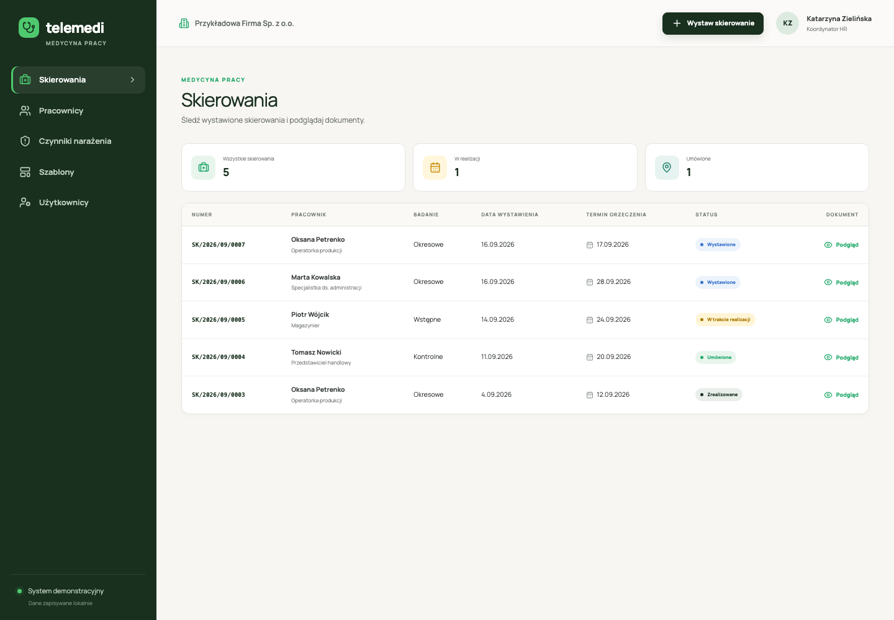
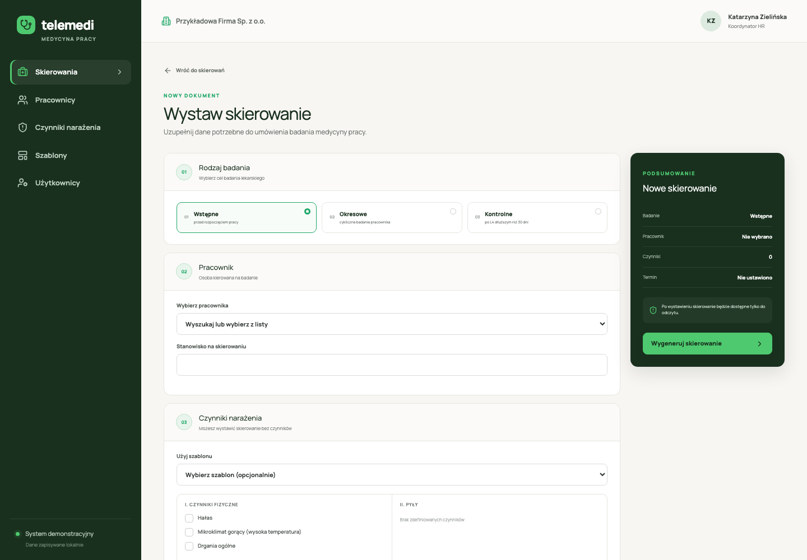
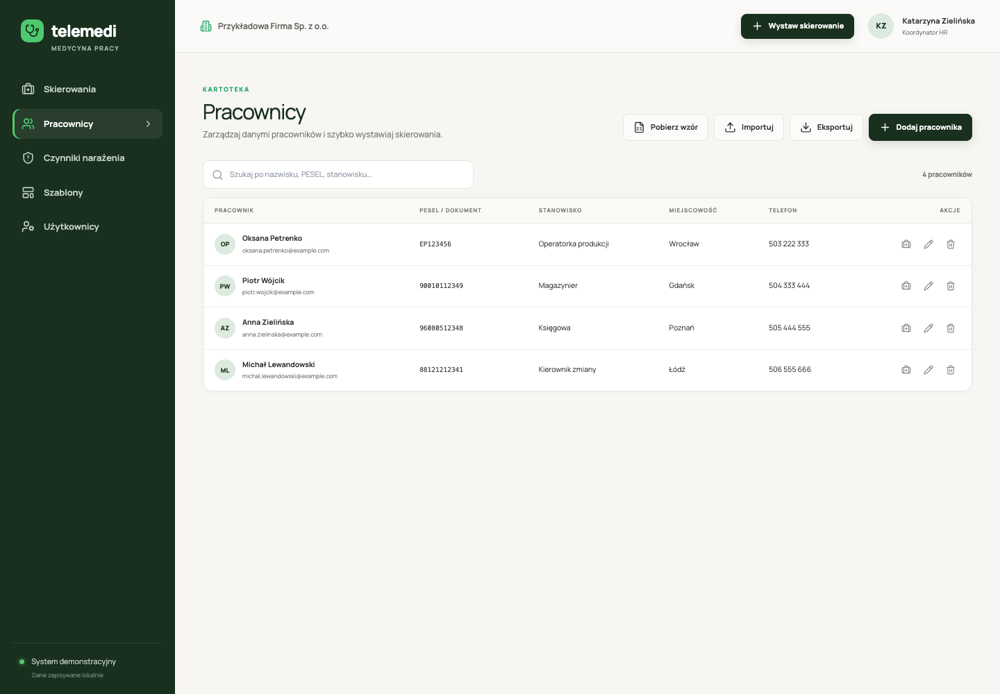
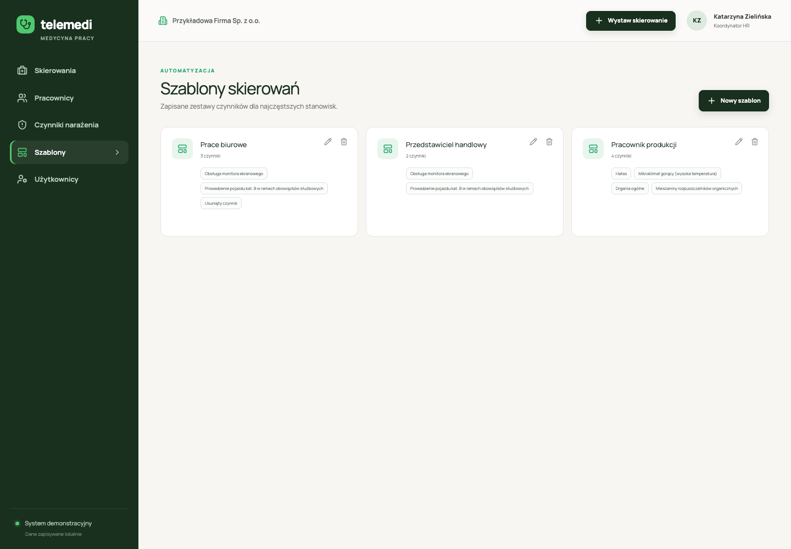

# Telemedi — Medycyna Pracy

Demo panelu pracodawcy do obsługi badań medycyny pracy. Aplikacja pozwala zarządzać pracownikami i czynnikami narażenia, tworzyć szablony oraz wystawiać skierowania przekazywane do realizacji przez Telemedi.

Projekt jest lokalnym demonstratorem — nie zawiera logowania ani prawdziwej integracji z call center i siecią medyczną. Dane są przechowywane przez `json-server` w pliku JSON.

## Podgląd aplikacji

### Skierowania



<details>
<summary>Zobacz pozostałe ekrany</summary>

### Wystawianie skierowania



### Pracownicy



### Szablony



</details>

## Funkcje

- lista skierowań z przykładowymi statusami,
- wystawianie badań wstępnych, okresowych i kontrolnych,
- generowanie i podgląd skierowania PDF,
- dodawanie, edycja, wyszukiwanie i usuwanie pracowników,
- import oraz eksport pracowników w formacie XLSX,
- pobieranie gotowego wzoru arkusza XLSX,
- zarządzanie systemowymi i własnymi czynnikami narażenia,
- tworzenie i edycja szablonów skierowań,
- dodawanie użytkowników HR z automatycznie generowanym loginem,
- lokalne dane demonstracyjne z możliwością szybkiego resetu.

## Stos technologiczny

- React 18 + TypeScript
- Vite
- React Router
- TanStack Query
- Tailwind CSS
- `json-server` 0.17.4
- SheetJS (`xlsx`)
- `@react-pdf/renderer`
- Lucide React

## Wymagania

- Node.js 18 lub nowszy
- npm

## Uruchomienie lokalne

```bash
npm install
npm run db:reset
npm run dev
```

Aplikacja będzie dostępna pod adresem:

```text
http://localhost:5173
```

Mock API działa pod adresem:

```text
http://localhost:3001
```

Vite przekazuje zapytania z `/api` do lokalnego `json-server`.

## Dostępne skrypty

| Polecenie | Działanie |
|---|---|
| `npm run dev` | Uruchamia aplikację i mock API |
| `npm run api` | Uruchamia wyłącznie `json-server` |
| `npm run db:reset` | Przywraca początkowe dane demonstracyjne |
| `npm run build` | Sprawdza TypeScript i tworzy build produkcyjny |
| `npm run preview` | Uruchamia lokalny podgląd gotowego buildu |

## Import pracowników z XLSX

W module **Pracownicy** wybierz **Pobierz wzór**. Arkusz ma następujący układ:

1. pierwszy wiersz — instrukcje dotyczące kolumn,
2. drugi wiersz — nagłówki,
3. trzeci i kolejne wiersze — dane pracowników.

PESEL należy wpisać w kolumnie **C — PESEL**. Najprościej nadpisać przykładowego pracownika w trzecim wierszu. Można również dopisać osoby poniżej — niezmieniony przykładowy wiersz zostanie automatycznie pominięty.

Jeżeli pracownik nie ma numeru PESEL, kolumnę PESEL należy pozostawić pustą i uzupełnić:

- rodzaj dokumentu,
- numer dokumentu,
- datę urodzenia.

Wymagane wartości rodzaju dokumentu to: `passport`, `id_card`, `residence_card` albo `other`.

## Dane demonstracyjne

Źródłem danych początkowych jest plik [`server/db.seed.json`](server/db.seed.json). Polecenie:

```bash
npm run db:reset
```

kopiuje go do `server/db.json`. Plik roboczy bazy jest pomijany przez Git, dzięki czemu lokalne zmiany nie trafiają przypadkowo do repozytorium.

Po resecie dostępne są między innymi:

- przykładowa firma,
- sześciu pracowników,
- systemowe czynniki narażenia,
- trzy szablony,
- skierowania w różnych statusach,
- domyślny koordynator HR.

## Scenariusz demonstracyjny

1. Dodaj nową osobę w module **Użytkownicy** i skopiuj wygenerowane dane logowania.
2. Pobierz wzór XLSX, uzupełnij pracowników i zaimportuj plik.
3. Dodaj własny czynnik narażenia.
4. Utwórz szablon zawierający wybrane czynniki.
5. Wystaw skierowanie dla pracownika.
6. Sprawdź nowe skierowanie na początku listy i otwórz podgląd PDF.

## Struktura projektu

```text
server/
  db.seed.json                 dane początkowe
  db.json                      lokalna baza json-server
src/
  api/client.ts                klient REST API
  domain/                      typy i polskie etykiety
  features/employees/xlsx.ts   import i eksport arkuszy
  features/referrals/          dokument PDF skierowania
  lib/utils.ts                 identyfikatory, loginy i numeracja
  App.tsx                      routing i moduły aplikacji
  index.css                    design system i layout
```

## Ograniczenia wersji demonstracyjnej

- brak prawdziwego logowania i uprawnień,
- konta HR istnieją wyłącznie jako dane demonstracyjne,
- statusy skierowań nie zmieniają się automatycznie,
- skierowania po wystawieniu są tylko do odczytu,
- walidacja i reguły biznesowe nie są egzekwowane przez backend,
- jednoczesne korzystanie z aplikacji przez wielu użytkowników nie jest obsługiwane,
- domyślny font dokumentu PDF może nie wyświetlać poprawnie wszystkich polskich znaków,
- aplikacja została przygotowana przede wszystkim dla widoku desktopowego.

## Build

```bash
npm run build
```

Gotowe pliki zostaną zapisane w katalogu `dist/`.

## Licencja

Projekt demonstracyjny przeznaczony do użytku wewnętrznego.
